# crypto-dashboard
Description: Real-time cryptocurrency tracking dashboard built with React (frontend) and Node.js (backend). Features live Bitcoin price charts, top 5 crypto metrics, KPI cards, responsive navigation, interactive charts with CoinGecko API, and WebSocket-powered real-time updates. 

<h1 align="center" style="color: #FFD966;">
  Crypto Dashboard - Real-Time Cryptocurrency Tracker
</h1>

  

## Purpose of the Project
Crypto Dashboard is a **real-time cryptocurrency tracking platform** built with React.  
It helps users track Bitcoin prices, monitor top cryptocurrencies, view detailed market trends, and access an interactive, responsive dashboard for informed decision-making. The project emphasizes **real-time updates**, **interactive charts**, and **an immersive user experience**.

##  Frameworks & Languages Used

- **Frontend:**  
React.js, Recharts/D3.js, TailwindCSS, HTML5, CSS3, JavaScript (ES6+)  

- **Backend:**  
Node.js, Express.js, MongoDB  

- **API & Real-Time Data:**  
CoinGecko API for live cryptocurrency data, WebSockets for real-time updates  

- **Other Tools:**  
Git, GitHub, VS Code

## What You Can Get from This Dashboard

- **Real-Time Bitcoin Prices:** Track live BTC prices and 24-hour trends.  
- **Top 5 Cryptocurrencies:** Monitor market capitalization, price changes, and trends.  
- **Interactive Charts:** Hover over charts to get detailed values and historical data.  
- **KPI Cards:** Quick snapshot of key metrics like price, volume, and market cap.  
- **Responsive Design:** Works smoothly on desktop, tablet, and mobile devices.  
- **Live News & Updates:** Stay informed with the latest crypto news.  
- **Tutorial & Guidance:** Step-by-step tutorial for using all dashboard features.  
- **Customizable Filters:** Slice and dice the data using currency or metric filters.  

## What I Have Done
- Developed a **dynamic frontend using React.js**, managing state efficiently with Hooks (`useState`, `useEffect`).  
- Integrated **CoinGecko API** for live cryptocurrency data including **prices, market caps, and trends**.  
- Built an **interactive data analytics dashboard** fetching **live data from a public API** (finance, weather, or health stats).  
- Implemented **real-time updates via WebSockets** for dynamic charts and tables.  
- Designed **interactive charts** using **Recharts/D3.js** for **real-time Bitcoin prices, 24h trends, and top crypto metrics**.  
- Created **KPI cards** for quick snapshot of key metrics, including **price, volume, and market cap**.  
- Added **filters, export options, and predictive charts** for enhanced data analysis.  
- Implemented **responsive sidebar navigation** to move seamlessly between **Home, Dashboard, Tutorial, News, About, and Author pages**.  
- Added **animated GIF backgrounds** for a smooth and engaging **user experience**.  
- Ensured the project is **fully responsive** and visually appealing on **desktop and mobile devices**.  
 

## How to Run Locally

1. **Clone the repository**
   `git clone https://github.com/yourusername/crypto-dashboard.git`
   `cd crypto-dashboard`

2. **Backend setup**

   - Navigate to the backend folder: `cd Backend`
   - Install dependencies: `npm install`
   - Start the server: `npm start`
   - The backend will run at: `http://localhost:5000` (or your configured port)

3. **Frontend setup**

   - Navigate to the frontend folder: `cd ../Frontend`
   - Install dependencies: `npm install`
   - Start the frontend: `npm run dev`
   - The frontend will run at: `http://localhost:3000`

### Dashboard Video Walkthrough
 Watch the real-time dashboard in action, including live Bitcoin charts, KPI cards, and top 5 crypto trends.

  <video width="720" controls style="border-radius:12px;">
    <source src="Frontend/src/assets/Task-2-dashboard-video - Made with Clipchamp.mp4" type="video/mp4">
    Your browser does not support the video tag.
  </video>

  <video width="720" controls style="border-radius:12px;">
    <source src="Frontend/src/assets/Task-2-dashboard-video - Made with Clipchamp.mp4" type="video/mp4">
    Your browser does not support the video tag.
  </video>

 ## Snapshots of the Project

 ### Home Page - Bitcoin Price Chart
- This is the main chart on the homepage, displaying real-time Bitcoin prices for the last 24 hours. Users can hover over points to see exact price values.

  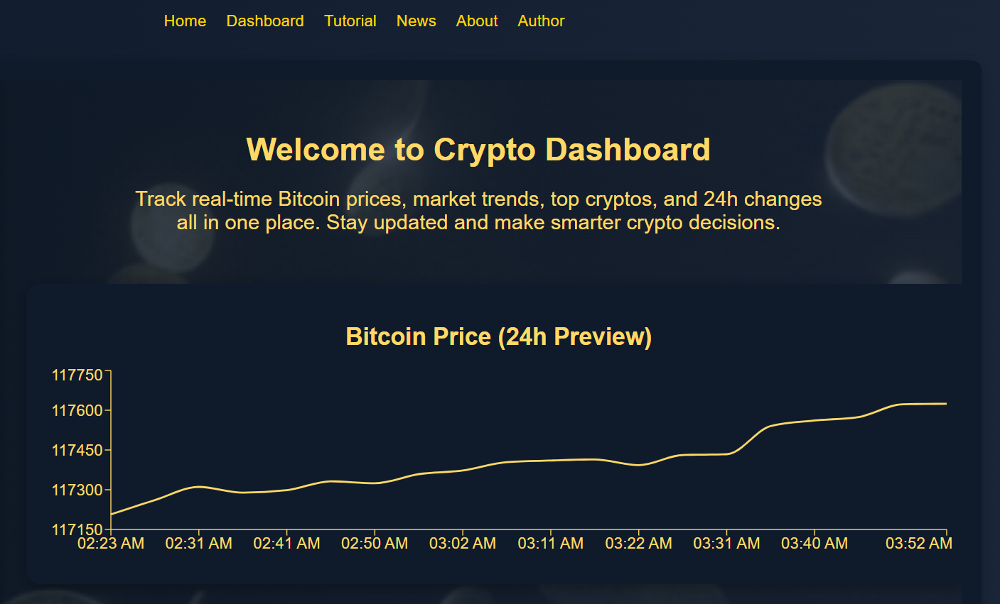

 ### Home Page - Top 5 Cryptocurrencies
- Displays the top 5 cryptocurrencies by market capitalization, including live price, market cap, and percentage change over 24 hours.

  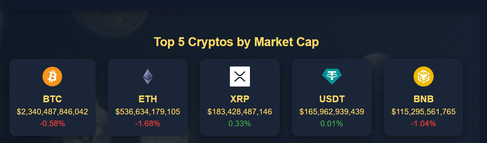

### Sidebar Navigation
- Sidebar on the homepage providing easy navigation to all sections: Home, Dashboard, Tutorial, News, About, and Author.

  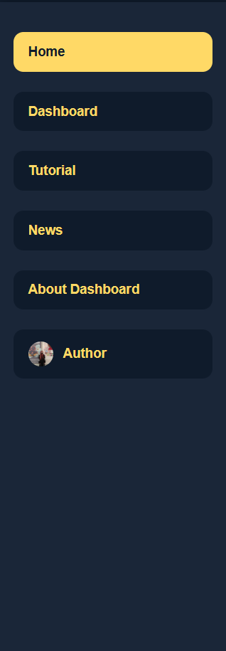

### Dashboard Page - KPI Cards
- Displays key performance indicators such as total market cap, volume, price change, and trending cryptocurrencies in an easy-to-read card format.

#

  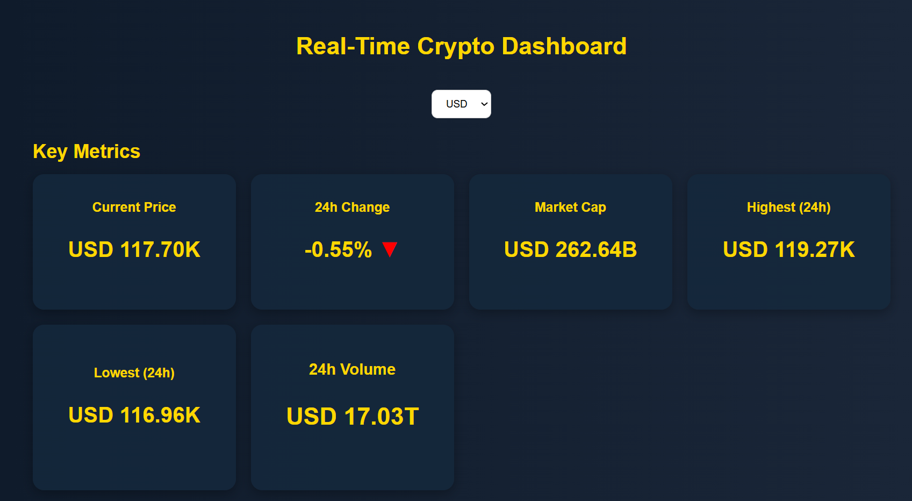

### Dashboard Page - Realtime Price Chart
- Detailed interactive chart below the KPI cards showing real-time Bitcoin price trends over the last 24 hours with hoverable data points.

  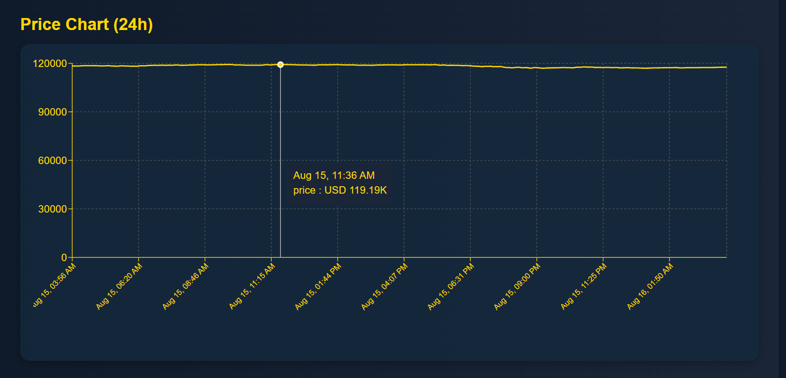

### Dashboard Page - Recent Prices Table
- Table showing the most recent prices of selected cryptocurrencies, making it easy to compare trends and values.

  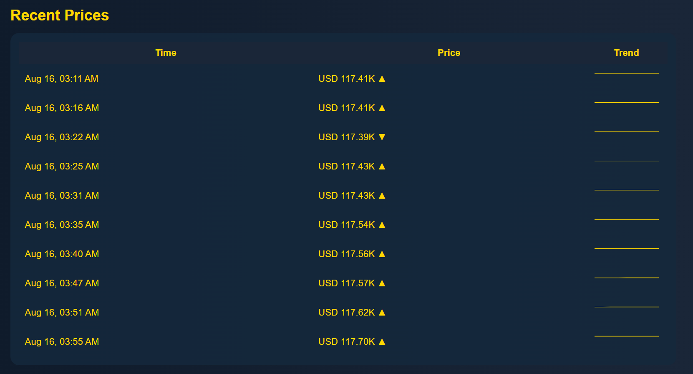

### Dashboard Page - 24H Price Trend Chart
- Displays a 24-hour real-time chart for selected cryptocurrencies, highlighting fluctuations and trends within a single day.

  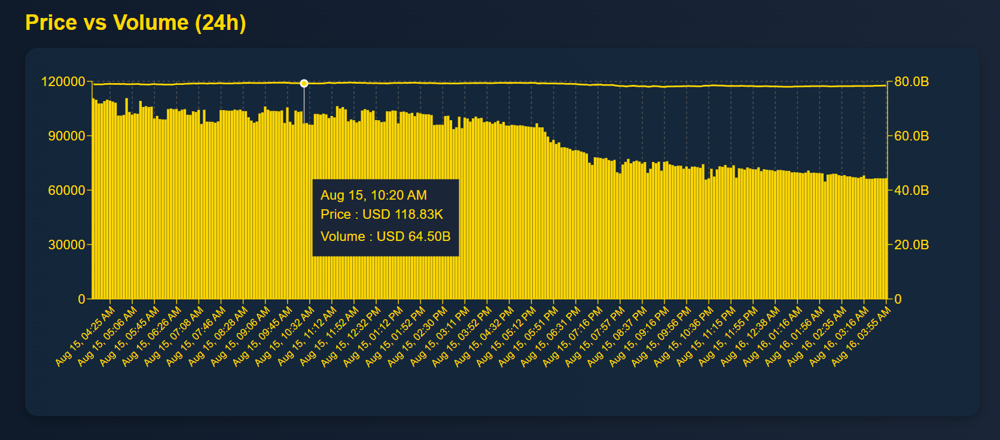

### Dashboard Page - Top 5 Crypto Donut Chart
- A donut chart visualizing the market share distribution of the top 5 cryptocurrencies, helping users quickly understand market dominance.

  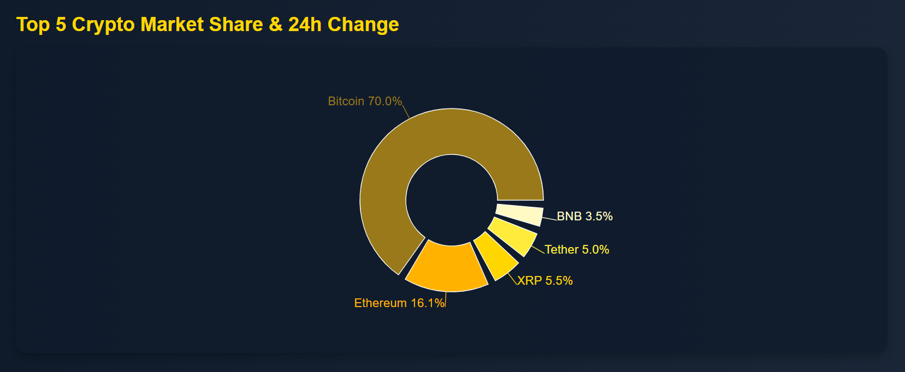

### Dashboard Page - Top 5 Crypto Trend Chart
- Line chart showing price trends for the top 5 cryptocurrencies over time, enabling users to identify upward or downward trends easily.

  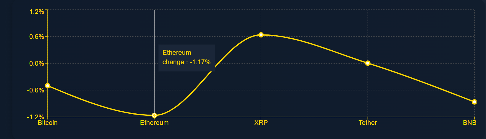

### Dashboard Page - Currency Slicer
- Interactive tool to filter all dashboard data based on the selected currency, providing a customized view of the market.

  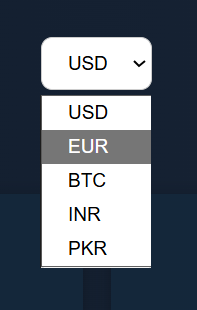

### Tutorial Page
- Step-by-step tutorial explaining all features of the dashboard and how users can interact with different charts and sections.

  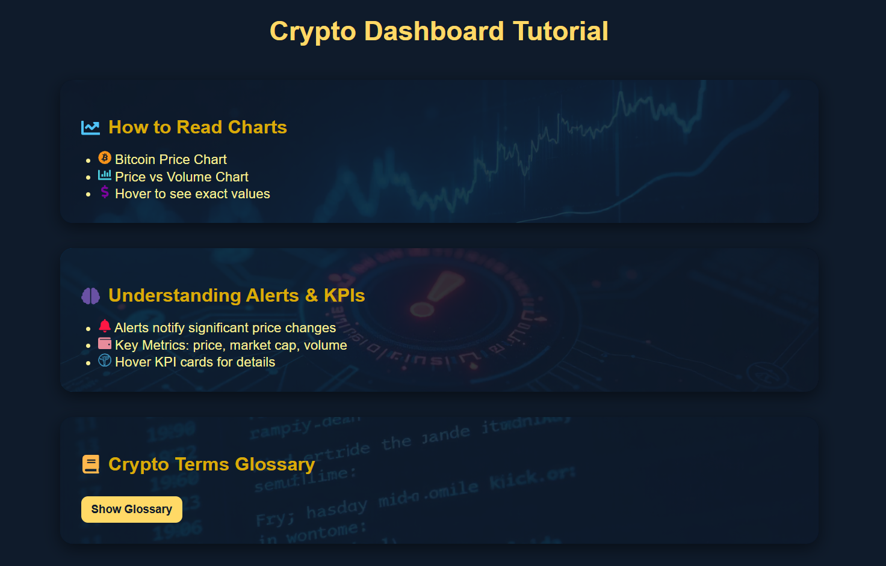

### News Page - Real-Time Crypto News
- Displays the latest cryptocurrency news fetched in real-time to keep users updated on market developments.

  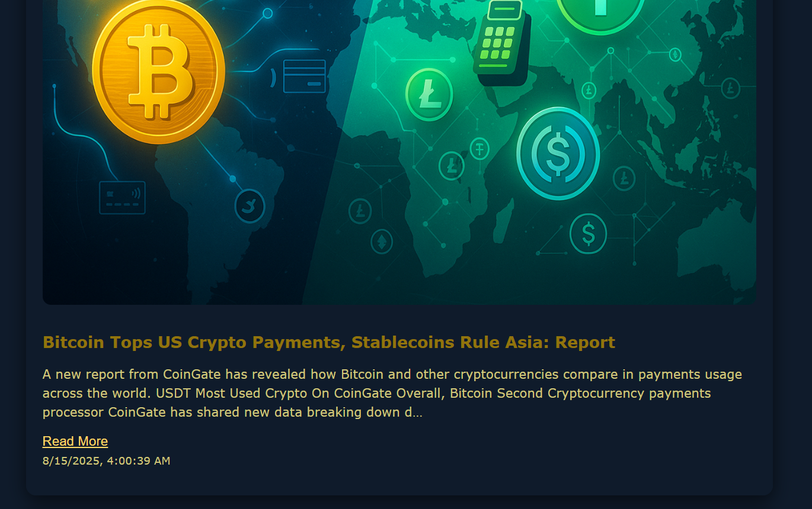

### News Page - Articles
- Examples of news articles within the news section, showing both headlines and summary snippets for quick reading.

  

  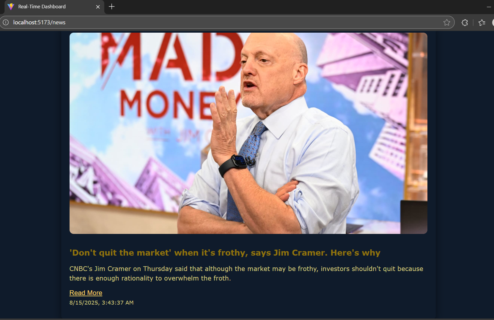

  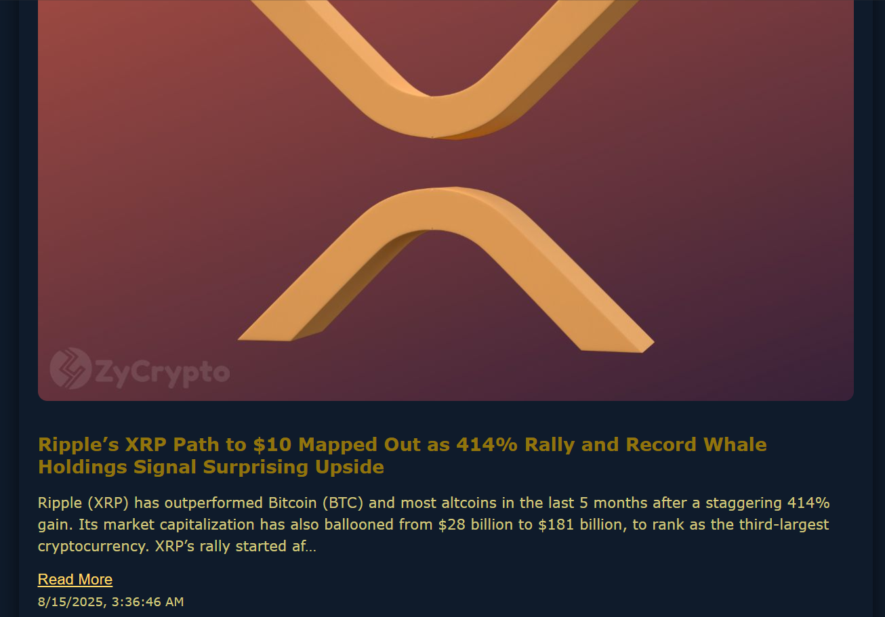

### About Dashboard Page
- Detailed explanation of the dashboard’s purpose, features, and implementation details.

  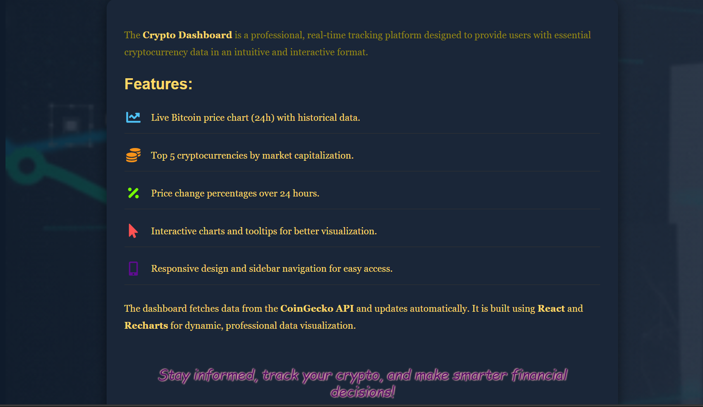

### About Author Page
- Showcases the developer’s profile, including skills, experience, and other relevant information.

  

  

### Glimpse of Code
 - Shows a screenshot of VS Code with project files and sample implemented code to illustrate the development workflow.

  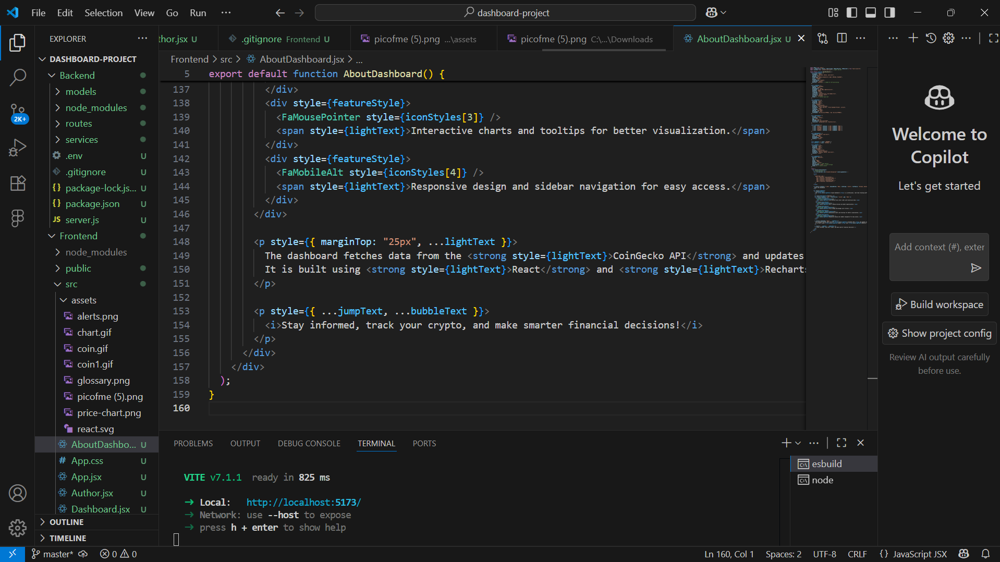

## By Insa Abbas
- Email: [insaabbas675@gmail.com](mailto:insaabbas675@gmail.com)
- GitHub: [https://github.com/insaabbas](https://github.com/insaabbas)

